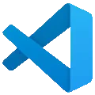

# Edytory kodu
## Przegląd
Z pośród wspieranych najpopularniejszych edytorów kodu wyróżniamy:

<table>
  <tr>
    <th>Brackets</th>
    <th>Sublime Text</th>
    <th>Visual Studio Code</th>
  </tr>
  <tr>
    <td></td>
    <td></td>
    <td></td>
  </tr>
  <tr>
    <th><a href="https://brackets.io/" target="_blank">brackets.io</th>
    <th><a href="https://www.sublimetext.com/" target="_blank">sublimetext.com</th>
    <th><a href="https://code.visualstudio.com/" target="_blank">code.visualstudio.com</th>
  </tr>
</table>

### Istotne czynniki przy wyborze technologii:

- kompatybilność
- popularność 
- wsparcie

## Instalacja

1. Wejdź na [code.visualstudio.com](https://code.visualstudio.com/)
2. Wybierz swoją platrformę i kliknij "pobierz"
3. Zainstaluj pobrany plik

  <a href="./#/version_control_systems?id=systemy-kontroli-wersji">Next: 👌  Systemy kontroli wersji</a>

