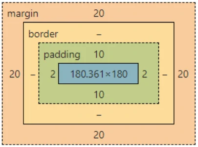
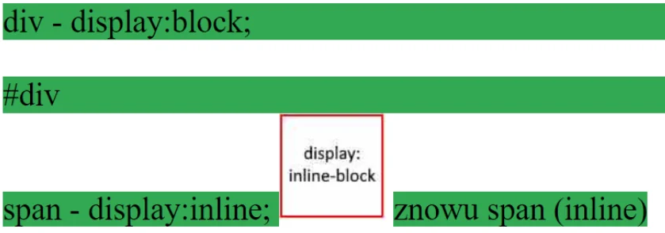
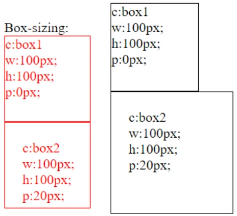

# Właściwości CSS
## margin / padding
<div class="standardWrapper">
<div>

```css
element.style {
    margin: 20px;
    padding: 10px 2px;
}
```
</div>
<div>



</div>
</div>

## display
```css
#div{
	display:none;
}

.element{
	display:block|inline|inline-block|none;
}
```



### Display:flex
<div class="code">

```html
<div class="dflex">
	<div>1</div>
	<div>2</div>
	<div>3</div>
</div>
```

```css
.dflex{
	background-color:green;
	width:100%;
	display:flex;
	justify-content: center;
}
.dflex div{
	text-align: center;
	width:30%;
	border: 3px solid #000;
	background-color:#eee;
	margin:5px;
	padding: 10% 0 10% 0;
}
```
</div>

<script>
	window.addEventListener('load', () => {

		
		document.querySelector('.code').style.border = "2px dashed red;"

	})
</script>


<style>
	.flex{
		background-color:green;
		width:100%;
		display:flex;
		justify-content: center;
	}
	.flex div{
		text-align: center;
		width:30%;
		border: 3px solid #000;
		background-color:#eee;
		margin:5px;
		padding: 10% 0 10% 0;
	}
</style>
<div class="container">
	<div class="flex">
		<div>
			1
		</div>
		<div>
			2
		</div>
		<div>
			3
		</div>
	</div>
</div>

[Flexbox Froggy](https://flexboxfroggy.com/)

## position
```html
<div class="static">
	STATIC
</div>

<div class="fixed">
	FIXED
</div>

<div class="sticky">
	STICKY
</div>


<div class="relative">
	RELATIVE

	<div class="absolute">
		ABSOLUTE
	</div>

</div>
```

```css
div{
	border:2px dashed red;
}

.static{
	position:static;
}

.fixed{
	position: fixed;
	bottom:10px;
}

.sticky{
	position:sticky;
	top:10px;
}

.absolute{
	position:absolute;
	bottom:10px;
	right:10px;
}

.relative{
	border:2px dashed blue;
	height:50vh;
	position:relative;
}
```


<style>
.positions {
	background-color:var(--codeBackgroundColor);
	overflow-y:scroll;
	height:300px;
}
.positions div{
	border:2px dashed red;
}

.positions .static{
	position:static;
}

.positions .fixed{
	position: fixed;
	bottom:10px;
}

.positions .sticky{
	position:sticky;
	top:10px;
}

.positions .absolute{
	position:absolute;
	bottom:10px;
	right:10px;
}

.positions .relative{
	border:2px dashed blue;
	height:500px;
	position:relative;
}

</style>
<!-- <div style='background-color:var(--codeBackgroundColor);'> -->
<div class='positions'>

<div class="static">
	STATIC
</div>

<div class="fixed">
	FIXED
</div>

<div class="sticky">
	STICKY
</div>


<div class="relative">
	RELATIVE
	<div class="absolute">
		ABSOLUTE
	</div>
</div>
</div>

## box-sizing*
```html
<!-- <div class="box1 box-sizing"> -->
<div class="box1">
</div>


<!-- <div class="box2 box-sizing"> -->
<div class="box2">
</div>
```
```css
.box1,.box2{
	border: 1px solid #000;
	width:100px;
	height:100px;
}
.box2{
	padding:20px;
}
.box-sizing{
	box-sizing:border-box;
}
```


