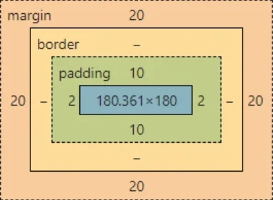

# Właściwości CSS
## margin / padding
<div class="standardWrapper">
<div>

```css
element.style {
    margin: 20px;
    padding: 10px 2px;
}
```
</div>
	<div>



</div>
</div>

## display
```css
#div{
	display:none;
}

.element{
	display:block|inline|inline-block|table|table-cell|none;
}
```


### Display:flex
```html
<div class="dflex">
	<div>1</div>
	<div>2</div>
	<div>3</div>
</div>
```
```css
.dflex{
	background-color:green;
	width:100%;
	display:flex;
	justify-content: center;
}
.dflex div{
	text-align: center;
	width:30%;
	border: 3px solid #000;
	background-color:#eee;
	margin:5px;
	padding: 10% 0 10% 0;
}
```


## position
```css
.element{
	position:static|sticky|absolute|relative|fixed;
}

```


## box-sizing*
```html
<!-- <div class="box1 box-sizing"> -->
<div class="box1">
</div>


<!-- <div class="box2 box-sizing"> -->
<div class="box2">
</div>
```
```css
.box1,.box2{
	border: 1px solid #000;
	width:100px;
	height:100px;
}
.box2{
	padding:20px;
}
.box-sizing{
	box-sizing:border-box;
}
```


