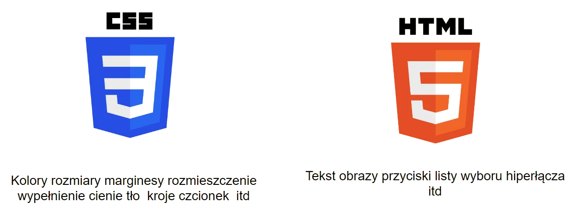

# PRZEGLĄD CSSA
## Powstanie CSS
Kaskadowe arkusze stylów (ang. **Cascading Style Sheets**, w skrócie **CSS**) – język służący do opisu formy prezentacji stron WWW. 

**Håkon Wium Lie** jako pierwszy zaproponował CHSS (Cascading HTML Style Sheets) w październiku 1994 roku.

Pod koniec 1996 roku wydano oficjalną dokumentację CSS, Kaskadowe arkusze stylów, poziom 1.


### Technologia 



## Struktura CSS
Arkusz stylów CSS to lista dyrektyw ustalających w jaki sposób ma zostać wyświetlana przez przeglądarkę internetową zawartość wybranego elementu HTML.

```css
h1{
   color:green;
   font-size:20px;
}

h2{ 
   padding: 12px
   border:2px dashed red;
}
```

### CSS w HTML
CSS został stworzony w celu odseparowania struktury dokumentu od formy jego prezentacji. Separacja ta zwiększa zakres dostępności witryny, zmniejsza zawiłość dokumentu, ułatwia wprowadzanie zmian w strukturze dokumentu.
Osadzamy go w sekcji head pliku HTML tagiem link:

```html
<head>
  <link rel="stylesheet" href="style.css">
</head>
```

## Rodzaje selektorów CSS
### Klasy
Selektor klasy wyszukuje każdy element z atrybutem class w dokumencie HTML. Atrybut class jest zdefiniowany jako lista przedmiotów oddzielonych ze sobą spacją, jeden z nich musi zgadzać się z daną klasą w selektorze (CSS)
```html
<div class=”gif_container” ></div>
```
```css
.gif_containter{
	border:2px dashed blue;
	/* kontur elementów */
}

```

możemy użyć kilku klas na jeden tag:

```html
<div class=”gif_container darkcolor” ></div>
```
```css
.darkcolor{
	color:black;
	/* kolor czcionki*/
}

```

### Identyfikatory
<!-- TODO: ZROBIĆ -->
### Tagi
<!-- TODO: ZROBIĆ -->


<div style="display:flex;justify-content:space-between;flex-wrap:wrap;">
  <a href="./#/html_basic_tags?id=tagi-podstawowe">Prev: 🏗️ Tagi podstawowe</a>
  <a href="./#/css_properties?id=właściwości-css">Next: 🥅 Podstawowe właściwości</a>
</div>
