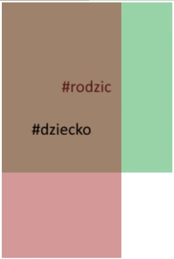
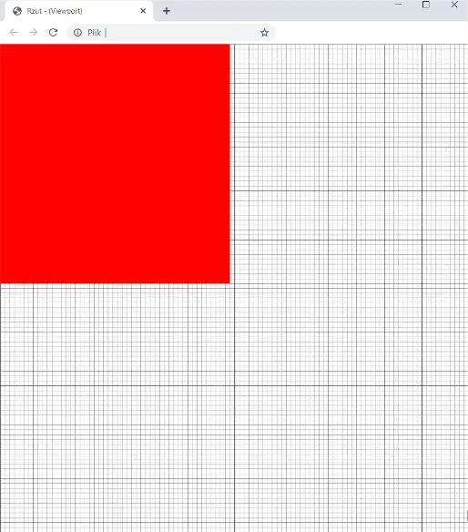
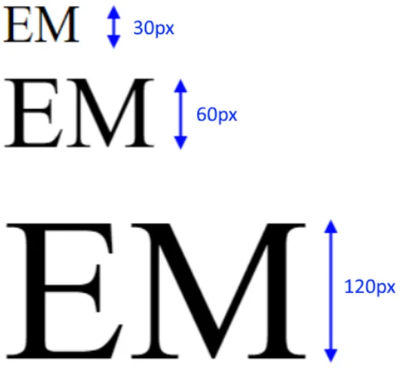
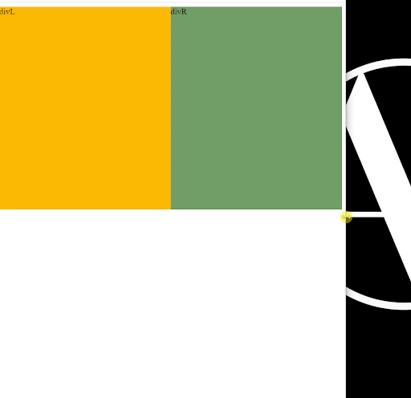

# Jednostki CSS
## Absolutne (bezwzględne)
<style>
  .units_ul li{
    position:relative;
    z-index:1;
  }
  .units_ul li:after{
    z-index:-1;
    content:"";
    background:yellow;
    position:absolute;
    height:calc(100% - 4px);
    width:100%;
    top:0;
    left:0;
    margin:2px;
  } 
  .units_ul .in:after{ width:5in; }
  .units_ul .cm:after{ width:5cm; }
  .units_ul .pc:after{ width:5pc; }
  .units_ul .mm:after{ width:5mm; }
  .units_ul .pt:after{ width:5pt; }
  .units_ul .px:after{ width:5px; }

</style>

<ul class="units_ul">
  <li class="in">&nbsp;&nbsp;cale (in)</li>
  <li class="cm">&nbsp;&nbsp;centymetry (cm)</li>
  <li class="pc">&nbsp;&nbsp;piki (pc)</li>
  <li class="mm">&nbsp;&nbsp;milimetry (mm)</li>
  <li class="pt">&nbsp;&nbsp;punkty (pt)</li>
  <li class="px">&nbsp;&nbsp;piksele (px)</li>
</ul>


## Relatywne (względne)
- Procenty (%)
- Wielkości czcionek (em i rem)
- Wymiary rzutu (vw i vh)

Relatywne jednostki bazują na
- Wielkości rodziców (%)
- Zadeklarowanych wielkościach czcionek (em, rem)
- Wielkościach rzutni - płaszczyzny strony (vw, vh, vmin, vmax)

### Procenty
```css
#rodzic{
	width:200px;
	height:200px;
}

#dziecko{
	width:70%;
	height:150%;	
}
```



### Rzuty 
- viewport width
- viewport height
```css
#vw{
    background-color:red;
    width:49vw;
    height:49vh;
}
```


### Wielkości czcionek - REM
```html
<div id="rodzic_rem">
	<div class="rem">REM
		<div class="rem">REM
			<div class="rem">REM
			</div>
		</div>
	</div>
</div>
```
```css
:root{
	font-size:5px;
}
#rodzic_rem{
	font-size: 15px;
}
.rem{
	font-size:2rem;
}
```

### Wielkości czcionek - EM
```html
<div id="rodzic_em">
	<div class="em">EM
		<div class="em">EM
			<div class="em">EM</div>
		</div>
	</div>
</div>
```
```css
#rodzic_em{
	font-size: 15px;
}
.em{
	font-size:2em;
}
```



## Media rule
```css
.divL,.divR{
	width:50%;
	height:50%;
}
@media only screen and (max-width: 600px) {
	.divL,.divR{
		width:100%;
	}	
}
```


