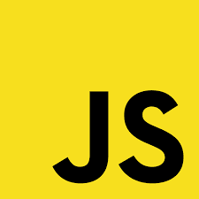
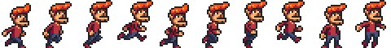
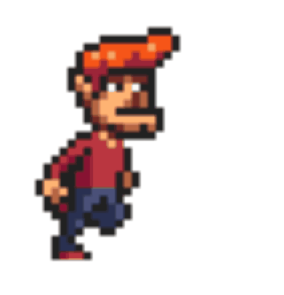

# Jumping game

<iframe src="src_html/jumper.html" style="min-height:40vh;border:none;z-index:1;"></iframe>

<!--  -->

## Canvas

Element HTML **&lt;canvas>** służy do rysowania grafiki w locie za pomocą JavaScript.
**&lt;canvas>** Elementem jest tylko kontenerem dla grafiki. Aby rysować grafikę, musisz użyć JavaScript.
Canvas ma kilka metod rysowania ścieżek, pól, okręgów, tekstu i dodawania obrazów.

```html
<canvas id="myCanvas" width="200" height="100" style="border:1px solid #000000;">
</canvas>
```

## Inicjujemy grę
Tworzymy gameplane - miejsce, w którym będzie wyświetlana cała gra.
```js
const gamePlane = {
    canvas : document.querySelector("canvas"),
    init(){
        this.canvas.width = 500;
        this.canvas.height = 250;
        this.context = this.canvas.getContext("2d");
    }        
}
```
## Dodajemy kompontent
Dodajemy playera. W tym celu tworzymy konstruktor component z podanymi wartościami:
```js
function component(w, h, x, y) {
    this.w = w;
    this.h = h;
    this.x = x;
    this.y = y;
    ctx = gamePlane.context;
    ctx.fillStyle = ‘red’;
    ctx.fillRect(this.x, this.y, this.w, this.h);
}
```
Następnie dodajemy playera globalnie, abyśmy mogli się do niego odnosić i tworzymy go z konstruktora component w init()

```js
let player ;       
player = new component(30, 30, 10, 120);
```

## Ustawiamy FPSy
Przy ładowaniu gamePlane dodajemy interval:
```js
this.interval = setInterval(this.update, 20);
```
I czyszczenie elementów przy ładowaniu gamePlane
```js
clear() {
  this.context.clearRect(0, 0, this.canvas.width, this.canvas.height);
}
```
W konstruktorze komponentu umożliwiamy aktualizację danych
```js
this.update = function(){
	ctx = gamePlane.context;
	ctx.fillStyle = color;
	ctx.fillRect(this.x, this.y, this.width, this.height);
 }
```

I dodajemy funkcję aktualizowania danych, wywołaną już w intervale:
```js
function updategamePlane() {
  gamePlane.clear();
  player.update();
}
```

## Sterowanie playerem
Dodaj listenery w gamePlane start:
```js
window.addEventListener('keydown', e => {
        gamePlane.key = e.key;
})
window.addEventListener('keyup', e => {
        gamePlane.key = false;
})     
```
Dodaj szybkość poruszania się do konstruktora component i funkcję newPos, do jej zmieniania
```js
this.speedY = 0;
this.newPos = function() {
  this.y += this.speedY;
}
```
W gamePlane.update, aktualizuj newPos:
```js
if(gamePlane.key){
  player.speedY = -5
}else{

  if(player.y < 150){
    player.speedY = 5
  }else{
    player.speedY = 0
  }
}
```

## Zmień przeszkodę, na tablicę przeszkody
```js
let obsts = [];
```
I zaktualizuj update:
```js
function updateGamePlane() {
    var x, y;
    for (i = 0; i < przeszkody.length; i += 1) {
        if (player.crashWith(przeszkody[i])) {
        gamePlane.stop();
        return;
        }
    }
    gamePlane.clear();
    gamePlane.frameNo += 1;
    if (gamePlane.frameNo == 1 || everyinterval(150)) {
        x = gamePlane.canvas.width;
        y = gamePlane.canvas.height - 200;
        przeszkody.push(new component(10, 200, "green", x, y));
    }
    for (i = 0; i < przeszkody.length; i += 1) {
        przeszkody[i].x += -1;
        przeszkody[i].update();
    }
    player.newPos();
    if (gamePlane.key && gamePlane.key == 38) {player.y = 100; }
    player.update();
}
```
## Tworzenie postaci z obrazka


Tworzenie postaci z obrazka
```html
<canvas></canvas>
```
```js
  let cx = document.querySelector("canvas").getContext("2d");
  let img = document.createElement("img");
  img.src = "img/player.png";
  let spriteW = 24, spriteH = 30;
  img.addEventListener("load", () => {
    let cycle = 0;
    setInterval(() => {
      cx.clearRect(0, 0, spriteW, spriteH);
      cx.drawImage(img,
                   // source rectangle
                   cycle * spriteW, 0, spriteW, spriteH,
                   // destination rectangle
                   0,               0, spriteW, spriteH);
      cycle = (cycle + 1) % 8;
    }, 120);
  });
```



## Ćwiczenie 2
Stwórz własną ruchomą postać


## Ustaw dotykanie przeszkód, kończące grę
W gamePlane:
```js
stop : function() {
    clearInterval(this.interval);
}
```
I component:
```js
this.crashWith = function(otherobj) {
    var myleft = this.x;
    var myright = this.x + (this.width);
    var mytop = this.y;
    var mybottom = this.y + (this.height);
    var otherleft = otherobj.x;
    var otherright = otherobj.x + (otherobj.width);
    var othertop = otherobj.y;
    var otherbottom = otherobj.y + (otherobj.height);
    var crash = true;
    if ((mybottom < othertop) ||
    (mytop > otherbottom) ||
    (myright < otherleft) ||
    (myleft > otherright)) {
    crash = false;
    }
    return crash;
}
```
## No i koniec gry
UpdateGamePlane:
```js
if (player.crashWith(przeszkoda)) {
    gamePlane.stop();
    } else {
    // tutaj cała reszta
}
```

## Poruszaj przeszkodą
W updateGamePlane
```js
przeszkoda.x += -1;
```

## Stwórz więcej przeszkód
Dodaj do gameplane.start:
```js
this.frameNo = 0; 
// I funkcję która zwróci true, kiedy frameNo będzie liczbą całkwoitą
function everyinterval(n) {
    if ((gamePlane.frameNo / n) % 1 == 0) {return true;}
    return false;
}
```

## Zmień rozmiary kolumn
W update:
```js
if (gamePlane.frameNo == 1 || everyinterval(150)) {
    x = gamePlane.canvas.width;
    minHeight = 20;
    maxHeight = 200;
    height = Math.floor(Math.random()*(maxHeight-minHeight+1)+minHeight);
    bottom = gamePlane.canvas.height - height;
    przeszkody.push(new component(10, height, "green", x, bottom));
}
```

## Dodawanie wyniku
```js
var myScore;
```

W startGame:
```js
myScore = new component("30px", "Consolas", "black", 280, 40, "text");
```

## Wynik
Component:
```js
// (pamiętaj, żeby dodać type w konstruktorze):
this.type = type;

function component(width, height, color, x, y,type){
```
W component.update:
```js
if (this.type == "text") {
  	ctx.font = this.width + " " + this.height;
  	ctx.fillStyle = color;
  	ctx.fillText(this.text, this.x, this.y);
} else {
  ... 
}
```
## gamePlane i updateGamePlane
W gamePlane:
```js
this.frameNo = 0;

  myGamePlane.frameNo += 1;
  myScore.text = "SCORE: " + myGameArea.frameNo;
  myScore.update();
```

## Zmień postać
Dodaj typ gracza:
```js
player = new component(50,50,"yellow",250,300,"player");
```
I dodaj cykl do componentu:
```js
  this.cyle = 0;
```

## I w component update
```js
...
} else if(this.type == "player"){
    var img = document.createElement("img");
    img.src = "img/"+color;
    var singleW = img.width/10;
    c.drawImage(img,
        this.cyle * singleW, 0, singleW, img.height,
        this.x-15, this.y, singleW, this.height);
    if(everyInterval(5) && this.jumping == false){
        this.cyle = (this.cyle + 1) % 8;
    }
}
```

+ Zmień przeszkody wg przykładu z player

## Restart game
```js
function restartGame() {
    document.querySelector(".gameInfo").style.display = "none";
    gamePlane.clear();
    player = {};
    przeszkody = [];
    myScore = {};
    document.querySelector("canvas").innerHTML = "";
    startGame();
}
```
