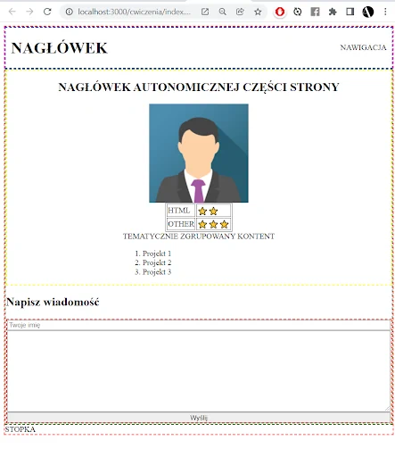

# Ćwiczenia CSS
## Ćwiczenie 3
Korzystając z właściwości border oraz display, poukładaj elementy na stronie jak na przykładzie. Cały nagłówek ustaw w pozycji sticky, aby był cały czas widoczny.

## Ćwiczenie 4
