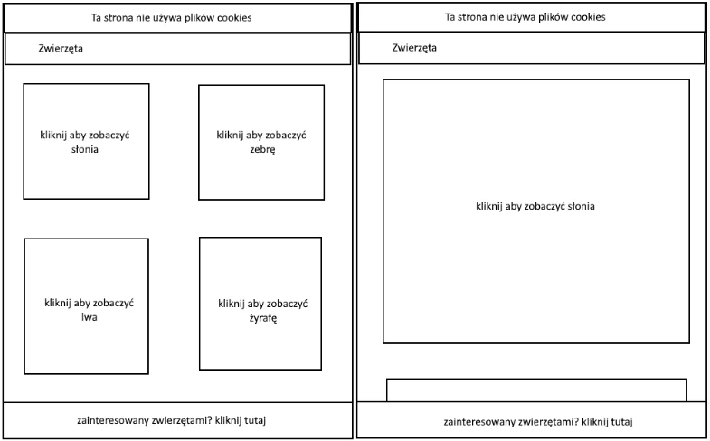

# Ćwiczenia CSS
## Ćwiczenie 3
Korzystając z właściwości border oraz display, poukładaj elementy na stronie jak na przykładzie. Cały nagłówek ustaw w pozycji sticky, aby był cały czas widoczny.

## Ćwiczenie 4
Wystylizuj stronę, spraw, by tabelka lądowała obok zdjęcia jeśli strona wyświetlana jest na komputerze, natomiast na telefonie ułóż je jedno pod drugim. Zadbaj też o wielkości czcionek.

## Ćwiczenie 5
Stwórz stronę wg schematu i ustaw pozycje:
- Cookies - static
- Zwierzęta - sticky
- Zainteresowany zwierzętami - fixed
- Kliknij … - absolute / relative - pod napisem 
<!-- TODO: pokaż obrazki stąd  -->
Pierwszy template desktopowy, drugi na wersji mobilnej

