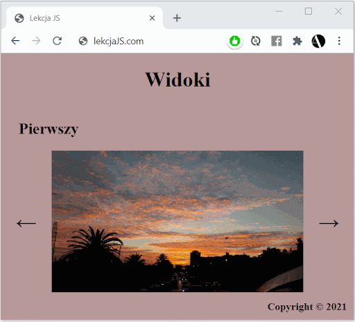

# Ćwiczenie 5

1. Stwórz 
[tablicę obiektów](/js_data_types?id=tablica-obiektów)
, z których każdy 
[obiekt](/js_data_types?id=obiekt-object)
 będzie zawierał tytuł i źródło zdjęcia
2. Stwórz 
[funkcję](/js_functions?id=deklaracja-funkcji)
, która będzie pobierała w argumencie numer slajdu (0 - 2) i na jego podstawie będzie wyświetlała wartości z tablicy (z pkt 1) 
[w dokumencie html’a](/js_dom?id=document-object-model)
 (będzie wyświetlała zdjęcie i tytuł)
3. Stwórz 
[zmienną](/js_overview?id=zmienne)
, która będzie zmieniała numery slajdów (np let **currentSlide** ...)
4. Stwórz kolejną 
[funkcję](/js_functions?id=deklaracja-funkcji), 
która będzie pobierać argument *left* lub *right* i dodaj do niej 
[warunek](/js_else?id=warunki-conditions)
, który w zależności od argumentu będzie 
[zwiększał lub zmniejszał](/js_else?id=operatory-operators)
 zmienną currentSlide, a następnie wykonywała (funkcja) funkcję stworzoną w pkt 2 ze zaktualizowanym argumentem currentSlide. 
5. [Pobierz html’owe strzałki z dokumentu](/js_dom?id=document-object-model)
 i dodaj do nich 
[wydarzenia wywołujące](/js_else?id=wydarzenia-events)
 funkcję z pkt 4 z odpowiednim argumentem (left lub right).

