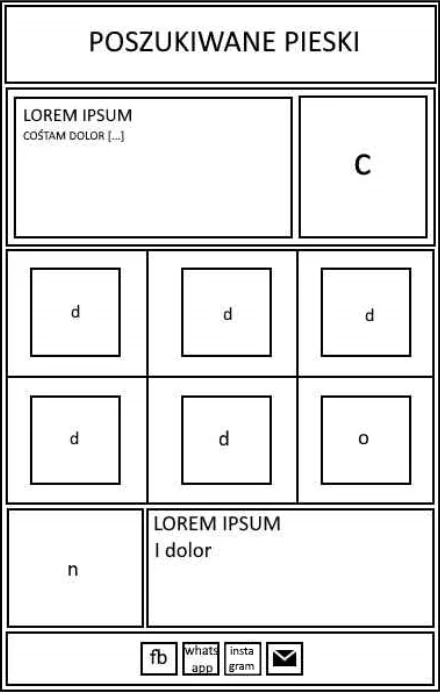

# Ćwiczenie Preprocesory
- Stwórz stronę, stylizując ją za pomocą SCSS lub SASS
- Pamiętaj o znakach semantycznych
- Polom oznaczonym od “d” do “o” ustaw coraz to jaśniejsze tło.
- W stopce ikonki:
  - Facebook
  - Whatsapp
  - Instagram
  - Mail

