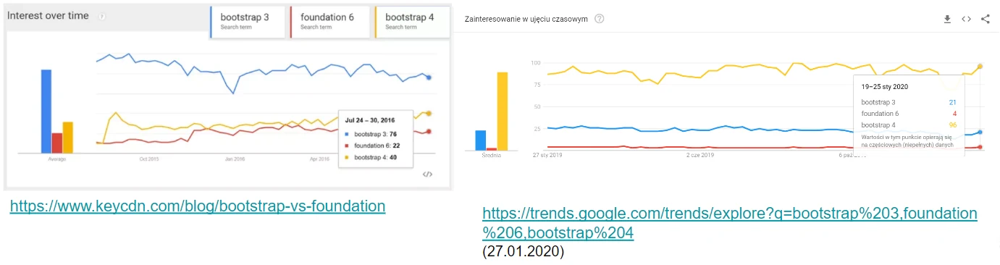

# Frameworki CSS
## Framework
Platforma programistyczna – szkielet do budowy aplikacji. Definiuje on strukturę aplikacji oraz ogólny mechanizm jej działania, a także dostarcza zestaw komponentów i bibliotek ogólnego przeznaczenia do wykonywania określonych zadań. Programista tworzy aplikację, rozbudowując i dostosowując poszczególne komponenty do wymagań realizowanego projektu, tworząc w ten sposób gotową aplikację.

### Najpopularniejsze frameworki CSS
**Bootstrap i Foundation** to najpopularniejsze frameworki HTML CSS.


## Bootstrap
Najpopularniejszy front-endowy framework, traktujący strony mobilne jako priorytet.

Używa HTML5 i CSS, poprawia wygląd wielu elementów, opiera się na JS.



Pomaga tworzyć strony szybciej i w RWD (Responsive Web Design)

### Implementacja
1. Możemy pobrać bootstrapa z oficjalnej strony
[https://getbootstrap.com/](getbootstrap.com)
2. Albo użyć **CDN (Content Delivery Network** - systemu dostarczania treści):
```html
<!-- Latest compiled and minified CSS -->
<link rel="stylesheet" href="https://maxcdn.bootstrapcdn.com/bootstrap/4.4.1/css/bootstrap.min.css">
<!-- jQuery library -->
<script src="https://ajax.googleapis.com/ajax/libs/jquery/3.4.1/jquery.min.js"></script>
<!-- Popper JS -->
<script src="https://cdnjs.cloudflare.com/ajax/libs/popper.js/1.16.0/umd/popper.min.js"></script>
<!-- Latest compiled JavaScript -->
<script src="https://maxcdn.bootstrapcdn.com/bootstrap/4.4.1/js/bootstrap.min.js"></script>
```

## Struktura bootstrap
