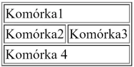
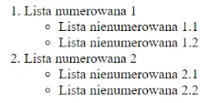

# Tagi podstawowe
## &lt;div&gt;
Div to skrót od divide czyli dzielić. Chodzi o podział obszaru strony na konkretne bloki.
```html
<div>
  Rodzic
  <div>Dziecko</div>
</div>
```

## &lt;table&gt;
<div style="display:flex;align-items:center;justify-content:space-between;">
  <div>

```html
<table border="1">
	<tr>
		<td colspan="2">Komórka1</td>
	</tr>
	<tr>
		<td>Komórka2</td>
		<td>Komórka3</td>
	</tr>
	<tr>
		<td colspan="2">Komórka 4</td>
	</tr>
</table>
```
  </div>
  <div>


  </div>
</div>

## &lt;ul&gt; / &lt;ol&gt;
- &lt;ol&gt; (ordered list) - lista numerowana
- &lt;ul&gt; (unordered list) - lista nienumerowana
- &lt;li&gt; (list item) - element listy 

<div style="display:flex;align-items:center;justify-content:space-between;">
  <div>

```html
<ol>
	<li>Lista numerowana 1
		<ul>
			<li>Lista nienumerowana 1.1</li>
			<li>Lista nienumerowana 1.2</li>			
		</ul>
	</li>
	<li>Lista numerowana 2
		<ul>
			<li>Lista nienumerowana 2.1</li>
			<li>Lista nienumerowana 2.2</li>
		</ul>
	</li>
</ol>
```
  </div>
  <div>


  </div>
</div>

## &lt;img&gt;
Img jest “wyjątkowym” znacznikiem pojedynczym. Wynika to z faktu, że wstawiając zdjęcie nie jesteśmy w stanie określić jego początku i końca, zamiast tego możemy określić jego wysokość i szerokość

```html
  
```

## &lt;h1&gt; [...] &lt;h6&gt;
Tagi h*, to nagłówki (ang. heading). Posługujemy się nimi, aby zatytułować konkretne bloki tekstu oraz nadać im hierarchię. 
Nagłówków mamy 6 (od największego):

<div style="display:flex;align-items:center;justify-content:space-between;">
  <div>

```html
<h1>HEADING 1</h1>
<h2>HEADING 2</h2>
<h3>HEADING 3</h3>
<h4>HEADING 4</h4>
<h5>HEADING 5</h5>
<h6>HEADING 6</h6>
```
  </div>
  <div>

<h1>HEADING 1</h1>
<h2>HEADING 2</h2>
<h3>HEADING 3</h3>
<h4>HEADING 4</h4>
<h5>HEADING 5</h5>
<h6>HEADING 6</h6>
  </div>
</div>


## &lt;form&gt;
Znacznik form pozwala na stworzenie formularza.
Formularzy używamy do pozyskania informacji od użytkownika. 
Wewnątrz formularzy używamy znaczników input z odpowiednimi parametrami (w zależności od tego jakiego typu informacje chcemy uzyskać)

<div style="display:flex;align-items:center;justify-content:space-between;">
  <div>

```html
<form action=”result.html” method=”post|get”>
  <input type=”text” name=”firstName” />
  <input type =”submit” />
</form>
```
  </div>
  <div>

<form action=”result.html” method=”post|get”>
  <input type=”text” name=”firstName” />
  <input type =”submit” />
</form>
  </div>
</div>

## Komentarze
Komentarzy w programowaniu używamy aby opisać konkretny fragment kodu. Pomaga to w: 
zorientowaniu się w kodzie po przerwie w pracy nad nim
Współpracy z innymi osobami 
Komentarze nie są widoczne w wyjściowym programie, jedynie w kodzie

```html
<!-- TO JEST KOMENTARZ HTML -->
```

[Ćwiczenie 2](/ex_html?id=Ćwiczenie-2)


<div style="display:flex;justify-content:space-between;">
  <a href="./#/html_semantic_tags?id=tagi-semantyczne">Prev: 🤖 Tagi semantyczne</a>
  <a href="./#/css_overview?id=przeglĄd-cssa">Next: 👁️ Przegląd CSS</a>
</div>
