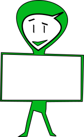

# PRZEGLĄD HTMLA 
## Powstanie HTML

<div class="standardWrapper">
  <div>
    <ul>
      <li>
        W 1980 roku Tim Berners-Lee stworzył pierwszy hipertekstowy system informacyjny - ENQUIRE. Rewolucyjność pomysłu polegała na tym, że użytkownik, posługując się odnośnikami, mógł z jednej lokalizacji przeglądać dokumenty fizycznie znajdujące się w innych miejscach na świecie. 
      </li>
      <li>
        W 1989 Robert Cailliau opracował dwa takie systemy, oparte o sieć internet. 
      </li>
      <li>
        W 1990 roku obydwaj panowie stworzyli WorldWideWeb.  
      </li>
    </ul>
    Struktura stron WWW jest oparta na plikach HTML, które to są plikami tekstowymi z rozszerzeniem .html lub .htm
  </div>
  <div>
    
  </div>
</div>

## Wyjątkowość HTML 
<!--  -->


## Składnia HTML
### Tag pojedynczy
**HTML - (ang. HyperText Markup Language)** – hipertekstowy* język znaczników.
Język opisowy oparty na znacznikach (tagach) opisujący zawartość strony internetowej.

<div class="exampleTagsContainer">
  <div class="exampleTag withUpperLabel">
    <div class="upperLabel">znacznik otwierający</div>
    <span style="color:var(--red);"><</span><span style="color:var(--blue);">a</span>
    <span style="color:var(--green);">href</span><span>=</span><span>"https://google.com"</span><span style="color:var(--red);">></span>
  </div>
  <div class="exampleTag">
    <span>&nbsp;Kliknij&nbsp;</span>
  </div>
  <div class="exampleTag withUpperLabel">
    <div class="upperLabel">znacznik zamykający</div>
    <span style="color:var(--red);">&lt;\</span><span style="color:var(--blue);">a</span><span style="color:var(--red);">></span>
  </div>
</div>

 - <span style="color:var(--red);">ostry nawias</span>
 - <span style="color:var(--blue);">znacznik / tag (a od "anchor" - kotwica)</span>
 - <span style="color:var(--green);">atrybut (właściwość): href hypertext referency (odnośnik hipertekstowy)</span>

*nazwa mechanizmu linkowania i przenoszenia się po kliknięciu pomiędzy różnymi dokumentami HTML

#### Przykład: 
```html
<a href="http://google.com">Kliknij</a>
```
Rezultat:
<a href="http://google.com">Kliknij</a>

### Tag podwójny
<div class="exampleTagsContainer">
  <div class="exampleTag withUpperLabel">
    <div class="upperLabel">znacznik podwójny (kontenerowy)</div>
    <span style="color:var(--red);"><</span><span style="color:var(--blue);">a</span>
    <span style="color:var(--green);">href</span><span>=</span><span>"https://google.com"</span><span style="color:var(--red);">></span>
    <span>&nbsp;Kliknij&nbsp;</span>
    <span style="color:var(--red);">&lt;\</span><span style="color:var(--blue);">a</span><span style="color:var(--red);">></span>
  </div>
</div>

<div class="exampleTagsContainer">
  <div class="exampleTag withUpperLabel">
    <div class="upperLabel">znacznik pojedynczy (samodzielny)</div>
    <span style="color:var(--red);"><</span><span style="color:var(--blue);">img</span>
    <span style="color:var(--green);">src</span><span>=</span><span>"photo.jpg"</span>
    <span style="color:var(--green);">alt</span><span>=</span><span>"My photo"</span>
    <span style="color:var(--red);">></span>
  </div>
</div>

## Struktura HTML
```html
<!DOCTYPE HTML>
```
To deklaracja, którą informujemy przeglądarkę, że będziemy pisać w najnowszym standardzie HTML5.
Jeśli chcesz pisać w innym standardze - przejrzyj 
[listę rekomendowanych deklaracji doctype organizacji W3C](https://www.w3.org/QA/2002/04/valid-dtd-list.html)

### Szkielet strony
<div class="standardWrapper">
  <div>

  ```html
  <!DOCTYPE HTML>
  <html>
    <head>
      <!-- 
        informacje o stronie, których nie widać, np:\
        - kodowanie znaków
        - język strony
        - tytuł i opis w wyszukiwarce
        - skrypty js 
        - arkusze styli css
        - czcionki Google 
        -->
    </head>
    <body>
      <!-- 
        tekst, obrazy, checkboxy, przyciski
        listy wyboru,
      -->
    </body>
  </html>
  ```
  </div>
  <div>

  
  </div>
</div>

<div class="prevNextButtons">
  <a href="./#/github?id=github">
    <button class="prev">🐙 GitHub</button>
  </a>
  <a href="./#/html_semantic_tags?id=tagi-semantyczne">
    <button class="next">🤖 Tagi semantyczne</button>
  </a>
</div>
