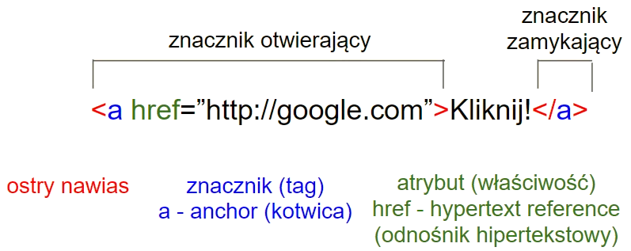
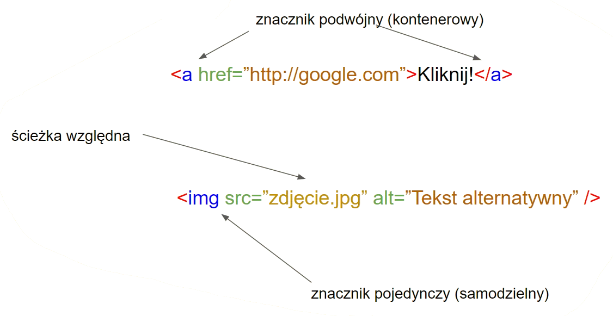
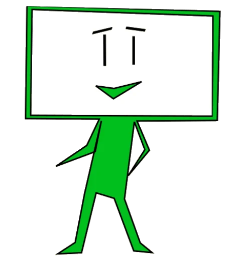

# PRZEGLĄD HTMLA 
## Powstanie HTML

<div style="display:flex;align-items:center;justify-content:space-between;">
  <div style="flex:1;">
    <ul>
      <li>
        W 1980 roku Tim Berners-Lee stworzył pierwszy hipertekstowy system informacyjny - ENQUIRE. Rewolucyjność pomysłu polegała na tym, że użytkownik, posługując się odnośnikami, mógł z jednej lokalizacji przeglądać dokumenty fizycznie znajdujące się w innych miejscach na świecie. 
      </li>
      <li>
        W 1989 Robert Cailliau opracował dwa takie systemy, oparte o sieć internet. 
      </li>
      <li>
        W 1990 roku obydwaj panowie stworzyli WorldWideWeb.  
      </li>
    </ul>
    Struktura stron WWW jest oparta na plikach HTML, które to są plikami tekstowymi z rozszerzeniem .html lub .htm

  </div>
  <div style="flex:1;">
    
  </div>
</div>

## Wyjątkowość HTML 


## Składnia HTML
### Tag pojedynczy
**HTML - (ang. HyperText Markup Language)** – hipertekstowy* język znaczników.
Język opisowy oparty na znacznikach (tagach) opisujący zawartość strony internetowej.



*nazwa mechanizmu linkowania i przenoszenia się po kliknięciu pomiędzy różnymi dokumentami HTML

#### Przykład: 
```html
<a href="http://google.com">Kliknij</a>
```
Rezultat:
<a href="http://google.com">Kliknij</a>

### Tag podwójny


## Struktura HTML
```html
<!DOCTYPE HTML>
```
To deklaracja, którą informujemy przeglądarkę, że będziemy pisać w najnowszym standardzie HTML5.
Jeśli chcesz pisać w innym standardze - przejrzyj 
[listę rekomendowanych deklaracji doctype organizacji W3C](https://www.w3.org/QA/2002/04/valid-dtd-list.html)

### Szkielet strony

<div style="display:flex;align-items:center;justify-content:space-between;">
  <div>

  ```html
  <!DOCTYPE HTML>
  <html>
    <head>
      <!-- 
        informacje o stronie, których nie widać, np:\
        - kodowanie znaków
        - język strony
        - tytuł i opis w wyszukiwarce
        - skrypty js 
        - arkusze styli css
        - czcionki Google 
        -->
    </head>
    <body>
      <!-- 
        tekst, obrazy, checkboxy, przyciski
        listy wyboru,
      -->
    </body>
  </html>
  ```
  </div>
  <div>

  
  </div>
</div>


<div style="display:flex;justify-content:space-between;">
  <a href="./#/github?id=github">Prev: 🐙 GitHub</a>
  <a href="./#/html_semantic_tags?id=tagi-semantyczne">Next: 🤖 Tagi semantyczne</a>
</div>
