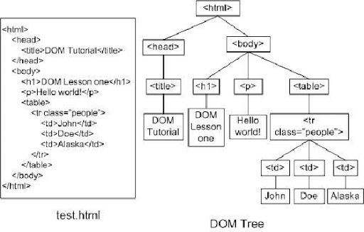

# Document Object Model
<table>
  <tr>
    <th>
      
    </th>
    <td>
      <b>HTML DOM</b> jest <b>Modelem Obiektu (Object Model) </b> dla HTML. Definiuje:
      <ul>
        <li>Elementy HTML jako <b>obiekty</b></li>
        <li><b>Właściwości</b> dla wszystkich elementów HTML'a</li>
        <li><b>Metody</b> dla wszystkich elementów HTML'a</li>
        <li><b>Wydarzenia</b> dla wszystkich elementów HTML'a</li>
      </ul>
    </td>
  </td>
  <tr>
    <th>
      
    </th>
    <td>
      <b>HTML DOM</b> jest <b> API (Programming Interface)</b> dla HTML. for <b>JavaScript</b>:
      <ul>
        <li>JavaScript może dodać/zmienić/usunąć elementy HTML'a</li>
        <li>JavaScript może dodać/zmienić/usunąć atrybuty HTML'a</li>
        <li>JavaScript może dodać/zmienić/usunąć style CSS'a</li>
        <li>JavaScript może dodać/zmienić/usunąć wydarzenia HTML'owe</li>
      </ul>
    </td>
  </td>
</table>



## Edycja istniejącego już tagu w dokumencie:
```js
// pobieranie elementu z dokumentu HTML'a
const viewField = document.querySelector(".viewField");

// wpisywanie tekstu  do .viewField 
viewField.innerHTML = "<div>Hello World</div>";

// Dla zdjęcia:
const photo = document.querySelector("img");
photo.src = "1.webp";
```
## Tworzenie nowego tagu HTML za pomocą JS:
```js
// tworzenie html'owego tagu 
const zdjecie = document.createElement("img");

// dopisywanie atrybutu src ()
zdjecie.src = "img/1.jpg";

// "dołączenie" tagu img do html'owego body
document.body.append(zdjecie);
```
