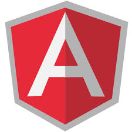
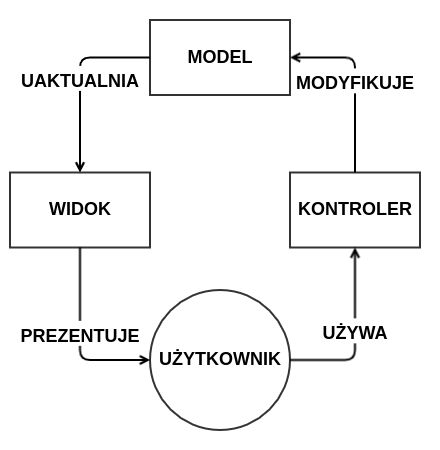
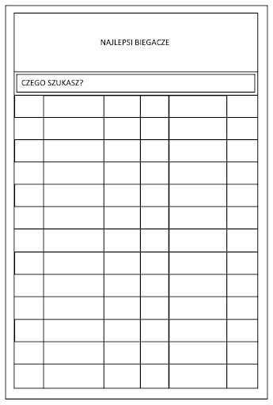
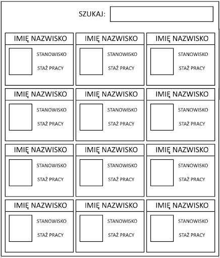

# AngularJS



**Angular** - kątowy (bo w HTML korzystasz z nawiasów kątowych)

**JS** - bo korzysta z JavaScriptu

**AngularJS** - rozwinięcie kątowych nawiasów HTML z pomocą języka JavaScript

## Czym jest

AngularJS to framework (bo daje gotowy szkielet do pisania aplikacji) napisany w JavaScript, wspierany przez firmę Google. Zadaniem biblioteki jest wdrożenie wzrorca MVC (Model-View-Controller).
Model ten zakłada podział aplikacji na 3 główne części:

- Model
- Widok
- Kontroler




Nazywany jest też frameworkiem
MVVM - Model-Widok-Widok-Model
MVW - Model-Widok-Cokolwiek (Whatever)

Poprawia user experience SPA (Single Page Application)


https://angularjs.org/

```html
<script src="https://ajax.googleapis.com/ajax/libs/angularjs/1.6.9/angular.min.js"></script>
```

## Ćwiczenie 1
Wyświetl najlepszych biegaczy z pliku biegacze.json i dodaj szukajke, aby dało się znaleźć konkretnego.



Wyświetl tabelę, gdzie będą zarówno biegacze, jak i wygrani w eurowizji. Pamiętaj o “szukajce”
Wyświetl
Rok
Miasto
Zwycięzce
Konkurencja / piosenka
Rezultat / Punkty

## Ćwiczenie 2
Stwórz zbiór danych 12 pracowników firmy XYZ, na który będzie się składać:
Imię
Nazwisko
Stanowisko
Staż pracy
Wyświetl go za pomocą AngularJS w sposób przedstawiony na schemacie. 


