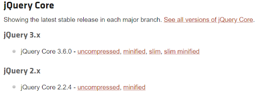
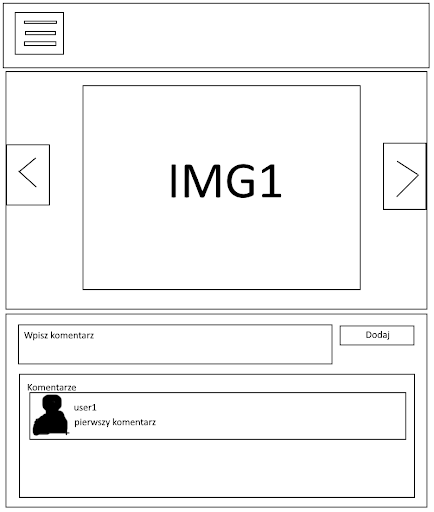

# jQuery
Biblioteka programistyczna – plik dostarczający podprogramy, dane oraz typy danych które mogą zostać wykorzystane z poziomu kodu źródłowego programu. Użycie bibliotek to sposób na ponowne wykorzystanie tego samego kodu.


- jQuery jest biblioteką JavaScriptu.
- upraszcza kod JS
- jest łatwa do nauczenia



https://code.jquery.com/

## Selektory 
<div class="exampleTagsContainer">
  <div class="exampleTag">
    <span style="color:var(--blue);">const</span>
    <span style="color:var(--red);">gifs</span>
    <span> = </span>
    <span style="color:var(--yellow);">$(</span>
    <span style="color:var(--pink);">".gif"</span>
    <span style="color:var(--yellow);">)</span>
    <span>;</span>
  </div>
</div>
<br />
<br />

<span style="color:var(--yellow);">$( ... )</span> - działa jak document.querySelector( ... )

## Selectors, events, hide/show
```js
$("p").hide();
$("#test").hide();
$(".test").hide();
$("*").hide();
$("[href]").hide();

$("p").click(function(){
  $(this).hide("slow");
	$(this).show("slow");
  $("a").toggle("slow");
});
```

## 2. Fade In/ Off / To
```js
$("p").click(function(){
	  $(this).hide("slow");
	  $(this).show("slow");
	  $("a").toggle("slow");
});

$("div").fadeOut("slow");
$("div").fadeTo("slow",0.2);

$("button").click(function(){
  $("div").fadeToggle(1000);
});
```
## 3. Slide Up/Down/Toggle
```js
$("div").slideUp();
$("div").slideDown("slow");

$("button").click(function(){
  $("div").slideToggle();
});
```

## 4. Animacje
```js
$("div").animate({left: '250px'});
$("div").animate({height: '250px'});
$("div").stop();
```

## 5. GET / SET / ADD
```js
console.log($("div").text());
console.log($("div").html());
console.log($("input").val());
console.log($("a").attr("href"));

$("div").text("Siemaneczko");
$("input").val("wartosc2");
$("img").attr("src", "myimage.jpg");

$("#myLink").text("Demo");
$("#myLink").attr("href", "https://www.demo.com");
$("p").append("COO?");
$("p").prepend("COO?");
```

## 6. Remove
```js
// remove
$("div").remove();
$("div").empty(); // usuwa dzieci
$("div").remove(".test, .demo"); // usuwa klasy test i demo
// classes
$("p").addClass("important test");
$("p").removeClass("important");
$("p").click(function(){
  $(this).toggleClass("important");
});
```

## 7. CSS i dimensions
```js
$("p").css("background-color", "pink");
$("p").css("border", "5px dotted red");
$("p").css("background-color");

$("div").height(500).width(500);
$("div").Height();	// 
$("div").innerHeight();	// włącznie z paddingiem
$("div").outerHeight();	// włącznie z paddingiem i borderem
$("div").outerHeight(true);	// włącznie z paddingiem, borderem i marginem
```

## 8. Traversing - pokolenia ;>
```js
$("span").parent();
$("span").parents(); // wszyscy przodkowie
$("div").children(); // dzieci
$("div").find("span"); // wszystkie dzieci spany
$("h2").siblings(); // rodzenstwo
$("h2").first(); // pierwsze dziecko
```

Ćwiczenia jQuery
https://www.w3schools.com/jquery/exercise_jq.asp


## Ćwiczenie
Zaprojektuj template jak na schemacie: 



oraz napisz funkcjonalności:
- Po kliknięciu na “hamburger” - ma pojawić się rozwijane menu
- Po kliknięciu na strzałki obok IMG1, zdjęcia mają się zmieniać (mogą być 3 zdjęcia), oraz każde zdjęcie ma mieć przypisane swoje komentarze (po zmianie ładowane w sekcji komentarze)
- Dodaj możliwość skomentowania zdjęcia,  
