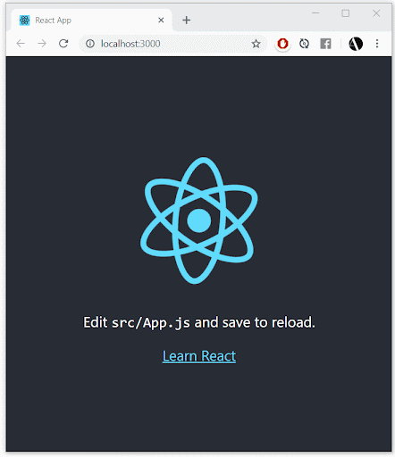
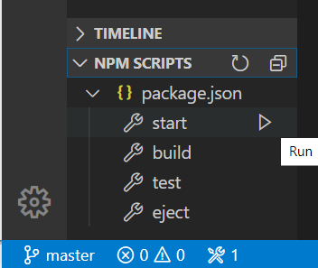
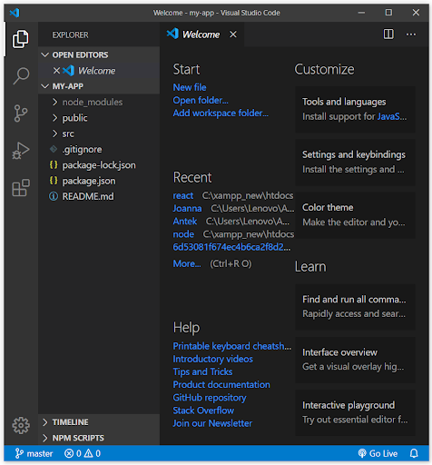
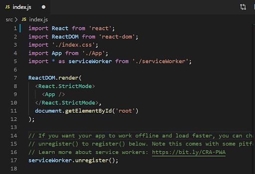
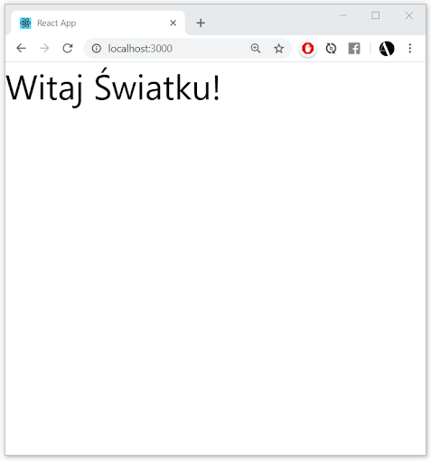
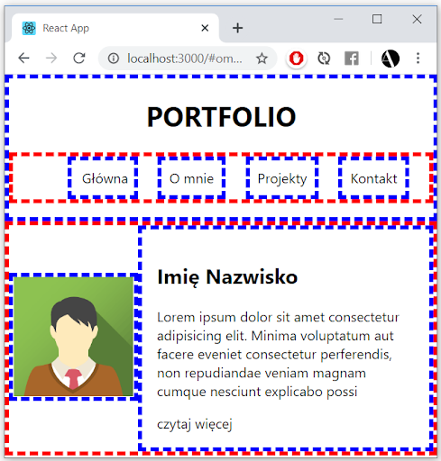
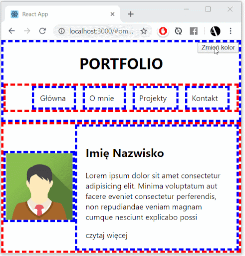

# ReactJS


React to biblioteka interfejsu użytkownika utworzona przez Facebook. Pomaga tworzyć interaktywne aplikacje internetowe złożone z komponentów (components) . 

Komponenty to takie niestandardowe tagi HTML. Fragmenty treści i zachowania wielokrotnego użytku, które można umieścić na stronie internetowej. Komponenty te są napisane w JS.

React obsługuje składnie JSX, która jest bardzo podobna do HTML’a, ale kompilujemy ją na JS.

## Tworzenie nowego projektu react
Wykorzystujemy node i npm :)
```
npx create-react-app my-app
```
, gdzie **my-app** jest nazwą naszej aplikacji

Odpalanie projektu React
w przeglądarce
```
cd my-app
npm start
```



## Odpalanie projektu react w VSC

Otwórz nową konsolę (+)
Wpisz:
```
cd my-app
code .
```



## Pliki projektu
### README.md
W tym pliku znajdują się wskazówki co robić w react. Warto otworzyć sobie ten plik jako podgląd (CTRL + SHIFT + V)

### src > index.js
Import - import bibliotek

ReactDom.render - render 
elementów na stronę

serviceWorker - skrypt 
uruchamiany przez 
przeglądarkę, działający 
niezależnie od niej. 
Odpowiada za procesy w tle np powiadomienia push



## Pierwsza funkcja

<div class="exampleTagsContainer">
  <div class="exampleTag">
    <span style="color:var(--green);">function</span>
    <span style="color:var(--red);">Pierwsza</span>
    <span>() {</span><br />
    <span style="color:var(--blue);">&nbsp;&nbsp;&nbsp;&nbsp;&nbsp;&nbsp;return </span>
    <span style="color:var(--pink);">&lt;div></span>
    <span> Witaj Światku! </span>
    <span style="color:var(--pink);">&lt;/div></span>
    <span>;</span><br />
    <span>}</span>
  </div>
</div>
<br />
<br />

```js
ReactDOM.render(<Pierwsza/>, document.querySelector('#root'));
```



## Ćwiczenie 1
1. Stwórz menu jak na przykładzie - w równych odstępach, z zachowaniem semantyki HTML5 - użyj header’a, nav’a i listy
2. Każdy przycisk podlinkuj do # (np Główną do #main, O mnie do #omnie etc.)
3. Nie używaj kolorów czcionek, ani tła - do oznaczania elementów użyj borderów


*Rekomendowany display: flex

## EMMET
1. Otwórz wiersz komend i wpisz “Open user settings” 
2. W “search settings” wpisz “Emmet”
3. Kliknij “Add item”, a następnie wpisz “javascript , javascrtiptreact”
4. Kliknij OK
5. Przed aktualizacją:
6. Pod “Include Languages” znajduje się “Edit in settings.json” - kliknij
7. Dopisz linię: 
```js
"emmet.includeLanguages": {
      "javascript":"javascriptreact"
}
```

## Przekazywanie właściwości (props)
single
```js
function Pierwsza(prop){
  return <header> 
          <h1>{prop.name}</h1>
          <ul>
            <a href='#omnie'><li> Główna </li></a>
            <li> O mnie </li>
            <li> Projekty </li>
            <li> Kontakt </li>
          </ul>
        </header>;
}
ReactDOM.render(<Pierwsza name='Ali'/>,document.getElementById("root"));
```
multiple
```js
function Pierwsza(prop){
  return <header> 
          <h1>{prop.name}</h1>
		 <h2>{prop.surname}</h2>
 
		<ul>
            <a href='#omnie'><li> Główna </li></a>
            <li> O mnie </li>
            <li> Projekty </li>
            <li> Kontakt </li>
          </ul>
        </header>;
}
ReactDOM.render(<Pierwsza name='Ali' surname='Baba' />,document.getElementById("root"));
```

### Co możemy przekazać

Właściwie wszystko, od funkcji, obiektu, zmienne, booleany, stringi. 
Tylko pamiętaj - wszystko co z js zapisujemy w klamrach - { }, np:
```js
<CustomButton
  green={true}
  width={64}
  options={{ awesome: "yes", disabled: "no" }}
  onClick={doStuffFunc}
/>
```

## KOMPONENTY
```js
function Hi({ name }) {
  return <div>Hello {name}!</div>;
}
```

## Ćwiczenie 2
1. Przerób funkcję ,,Pierwsza”, na strzałkową z trzema “rekwizytami” - “imgSrc”, “nazwa” oraz “opis”.
2. Jako zdjęcia użyj tego linku: 
https://www.w3schools.com/w3images/avatar2.png
3. Jako rekwizyt “opis” użyj lorem ipsum, a jeśli jego długość będzie przekraczać 180 znaków, dodaj pole “czytaj więcej” (zrób to za pomocą operatora logicznego)




## Zarządzanie stanem

State pozwala komponentom śledzić wartości, które mogą się zmieniać.

```js
const state = React.useState(true);
const isLight = state[0];
const setLight = state[1];

function Trzecia() {
  const [isLight, setLight] = React.useState(true);

  return (
    <div className="layout">layout jest Light</div>
  );
}
```

Wywołaliśmy stan z wartością true. Funkcja ta zwraca dwie wartości w tablicy - pierwsza to wartość stanu więc isLight będzie true, a druga to funkcja zmiany stanu.
Możemy spotkać się z takim sposobem:
Wtedy możemy wywołać useState bezpośrednio: 

```js
import React, { useState } from 'react';
const [isLight, setLight] = useState(true);
```

### Render zależny od stanu

Po zmianie na “false”, output będzie:
Layout jest ciemny

```js
function Trzecia() {
  const [isLight, setLight] = React.useState(true);

  return (

    <div className="layout">
      Layout jest {isLight ? 'jasny' : 'ciemny'}
    </div>

  );
}
```

###  Zmiana stanu przez przycisk
Który z tych przycisków będzie działał poprawnie?


```js
<button onClick={() => setLight(!isLight)}>
    przełącz
</button>
```
setLight wykona się dopiero po kliknięciu na przycisk i wtedy zmieni jego stan i wyrenderuje ponownie

```js
<button onClick={setLight(!isLight)}>
    przełącz
</button>
```
setLight wykona się od razu - przed renderem przycisku, 


Funkcja setLight ma 2 zadania:
- zmienia stan
- renderuje komponent

### Zmiana className za pomocą przycisku
```js
const brightness = isLight ? "light" : "dark";
```
```js
<div className={`layout ${brightness}`}>
```

Backtick’i oznaczają ciąg szablonu w ES6, dzięki czemu możemy wprowadzać do nich zmienne

Można też osiągnąć to samo bez dodawania zmiennej brightness:
```js
<div className={`layout ${isLight ? "light" : "dark"}`}>
```

### CSS
```css
.light{
	background-color: #fff;
	color : #000;
}
.dark{
	background-color:#000;
color:#fff;
}
```

## Ćwiczenie 3
Dodaj przycisk w prawym górnym rogu. Zaprogramuj go tak, aby po kliknięciu zmieniał kolor tła całego projektu




### Pobieranie danych z API

Wybór biblioteki HTTP
- najpopularniejsze to Fetch i Axios
Instalujemy:
```
npm install axios
```

Importujemy:
```js
import axios from 'axios';
```


### Wrzucamy projekt na serwer

Budujemy projekt:
```
npm run build
```
Użyjemy do tego surge.sh
```
npm install -s surge
```
I przechodzimy do zbudowanej aplikacji

```
cd build
surge
```