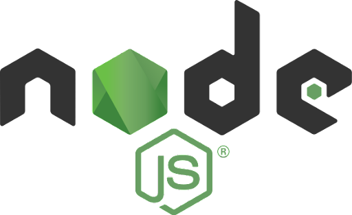

# Node.js
Platforma do uruchamiania kodu JavaScript bez udziału przeglądarki.(server side)



https://nodejs.org/en/

Sprawdź instalację node JS
```bash
node -v
```

## NPM 
Systemy zarządzania pakietami


System zarządzania pakietami – zestaw narzędzi służących do automatycznej instalacji, aktualizacji, konfiguracji i usuwania pakietów oprogramowania.

https://www.npmjs.com/

Aplikacja wiersza poleceń pozwalająca w szybki i wygodny sposób instalować moduły tworzone przez społeczność.

npm (Node Package Manager) - domyślny manager pakietów dla środowiska Node.js, może być także używany do zarządzania warstwą front-end aplikacji WWW.

Składa się z klienta wiersza poleceń, zwanego także npm, oraz internetowej bazy danych publicznych i płatnych pakietów prywatnych, zwanej rejestrem npm. Rejestr jest dostępny za pośrednictwem klienta, a dostępne pakiety można przeglądać i wyszukiwać za pośrednictwem strony internetowej npm.

### package.json

Każdy projekt korzystający z Node.js musi mieć plik package.json.
package.json można opisać jako manifest (wypowiedź) projektu, który zawiera pakiety i aplikacje od których zależy, informacje o unikalnej kontroli źródła oraz określone metadane, takie jak nazwa projektu, opis i autor.


PLIK TEN ZAWSZE MA FORMAT .JSON!

### Tworzenie package.json

1. Zainicjuj package komendą “npm init”
2. Wpisz informacje o swojej paczce

### Instalacja paczek

Wpisz w terminalu “npm install” i nazwę paczki którą chcesz zainstalować
Oznacz ją flagą:

--global / -g  - instaluj globalnie, do każdego projektu

--save / -s   - “dependencies”  czyli paczki, które będą używane tylko w produkcji naszej aplikacji (np. vue)

--save-dev / -d - zależności developerskie, wykorzystywane tylko w produkcji (np webpack)


npm install hello-world-npm -s

### Sprawdzenie zainstalowanej paczki

Tworzymy plik nazwa.js
Wpisujemy zmienną z pobranej paczki: 
```js
let helloworld = require('hello-world-npm');
```
Sprawdzamy typ zmiennej
```js
console.log(typeof helloworld);
```
Wykonujemy skrypt pliku wpisując w terminalu
```bash
node nazwa.js
```
Wyświetlamy zmienną helloworld

## Ćwiczenie 1

Stwórz stronę internetową, na której wyświetli się “Hello World Npm” pobrane z przykładowego pakietu.

