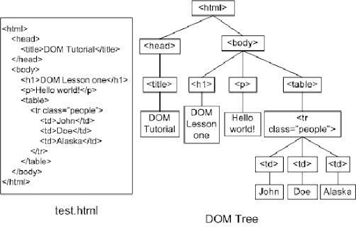

# Document Object Model

## Edycja istniejącego już tagu w dokumencie:
```js
// pobieranie elementu z dokumentu HTML'a
const viewField = document.querySelector(".viewField");

// wpisywanie tekstu  do .viewField 
viewField.innerHTML = "<div>Hello World</div>";

// Dla zdjęcia:
const photo = document.querySelector("img");
photo.src = "1.webp";
```
## Tworzenie nowego tagu HTML za pomocą JS:
```js
// tworzenie html'owego tagu 
const zdjecie = document.createElement("img");

// dopisywanie atrybutu src ()
zdjecie.src = "img/1.jpg";

// "dołączenie" tagu img do html'owego body
document.body.append(zdjecie);
```
