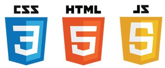

# Przegląd JS
## Historia JavaScript
<div class="standardWrapper">
<div>
  Skryptowy oraz wieloparadygmatowy język programowania, stworzony przez firmę Netscape, najczęściej stosowany na stronach internetowych. Twórcą JavaScriptu jest Brendan Eich.

  Początkowo Netscape nazwała nowy język LiveScript. Nazwa została jednak szybko zmieniona na JavaScript wskutek biznesowych porozumień pomiędzy Netscape a firmą Sun Microsystems, lecz JavaScript i Java to mimo wszystko dwa różne języki.
</div>
<div>

  
</div>
</div>

## Do czego JS?
HTML definiuje elementy na stronie, CSS ich wygląd, 
JavaScript definiuje zachowanie poszczególnych elementów.


## Komunikacja z JavaScript - konsola


```html
<script>
  console.log("Hello World");
</script>
```

## Zmienne

<div class="exampleTagsContainer">
  <div class="exampleTag withUpperLabel">
    <div class="upperLabel">znacznik otwierający</div>
    <span style="color:var(--red);"><</span><span style="color:var(--blue);">a</span>
    <span style="color:var(--green);">href</span><span>=</span><span>"https://google.com"</span><span style="color:var(--red);">></span>
  </div>
  <div class="exampleTag">
    <span>&nbsp;Kliknij&nbsp;</span>
  </div>
  <div class="exampleTag withUpperLabel">
    <div class="upperLabel">znacznik zamykający</div>
    <span style="color:var(--red);">&lt;\</span><span style="color:var(--blue);">a</span><span style="color:var(--red);">></span>
  </div>
</div>