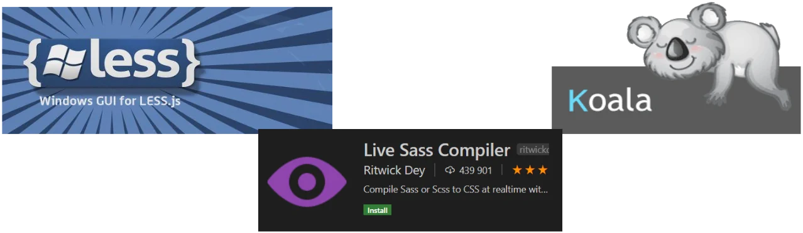
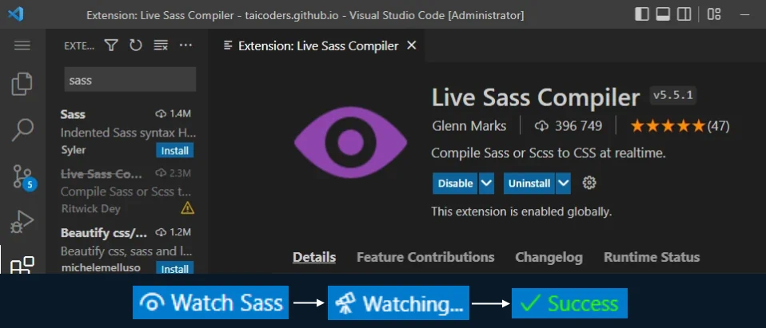

# Preprocesory CSS
## Czym są
Preprocesory CSS najczęściej określane są jako narzędzia, pozwalające nam na tworzenie oraz utrzymywanie arkuszy stylów CSS w sposób:
- lepiej zorganizowany
- czytelniejszy 
- prostszy 
- **szybszy**

## Po co są ? 
1. Wiele razy zdarza się, że stylując jakiś element kopiujemy obszerne fragmenty kodu, tylko po to by zmienić w nich parę liczb czy kolorów. Owy element poza paroma wielkościami czy kolorami nie różni się bowiem wiele od wcześniej stylowanego komponentu.
2. Mając do czynienia z naprawdę dużym zbiorem stylów dla całego serwisu możemy się zgubić, czy wpaść w konflikty z poprzednimi klasami. Bardzo ciężko jest czasami tego uniknąć.
3. Męczy nas powtarzanie tego samego kodu cały czas. Przez mnogość znaków i selektorów kod jest nieczytelny.


## Działanie 
Niestety pisząc kod CSS z użyciem preprocesorów, nie jest on rozumiany przez przeglądarki jak standardowy plik ze stylami CSS. Przez to nasz kod musimy skompilować do kodu CSS aby działał jak należy.



## Środowisko


## SASS / SCSS NESTING - ZAGNIEŻDŻANIE
SASS - Syntactically Awesome Style Sheets (niesamowicie składniowe arkusze stylów)

SCSS - Sassy Cascading Style Sheet (Impertynencki Kaskadowy Arkusz Stylów - tłum. autor) 

impertynent «osoba zachowująca się wobec kogoś arogancko, obraźliwie» - sjp.pwn.pl

```css
/* SCSS */
nav {
  ul {
    margin: 0;
    padding: 0;
    list-style: none;
  }

  li { display: inline-block; }

  a {
    display: block;
    padding: 6px 12px;
    text-decoration: none;
  }
}
```
```css
/* SASS */
nav
  ul
    margin: 0
    padding: 0
    list-style: none

  li
    display: inline-block

  a
    display: block
    padding: 6px 12px
    text-decoration: none
```

```css
nav ul {
  margin: 0;
  padding: 0;
  list-style: none;
}
nav li {
  display: inline-block;
}
nav a {
  display: block;
  padding: 6px 12px;
  text-decoration: none;
}
```

## Zmienne
```css
$font-stack:    Helvetica, sans-serif;
$primary-color: #333;

body {
  font: 100% $font-stack;
  color: $primary-color;
}
```

## Mixins
```css
@mixin transform($property) {
  -webkit-transform: $property;
  -ms-transform: $property;
  transform: $property;
}
.box { @include transform(rotate(30deg)); }
```

## Operatory
```css
.container {
  width: 100%;
}

article[role="main"] {
  float: left;
  width: 600px / 960px * 100%;
}

aside[role="complementary"] {
  float: right;
  width: 300px / 960px * 100%;
}
```

## Pętla for
```css
@for $i from 1 through 5 {
    .definition-#{$i}{width:10px * $i;}
}
```

## Podsumowanie
### Różnice:
- SASS jest oparty na Ruby, LESS używa JavaScriptu. 
- **W SCSS można stosować składnię CSS**
- LESS daje możliwość używania MIXINS tylko w określonych sytuacjach
- SASS oferuje rozróżnianie liter, pętle, no i różne składnie (SCSS)
- Początkowo LESS był wspierany przez framework Bootstrap, ale od wersji 4 wspierany jest SASS, który jest najpopularniejszym preprocesorem. 

