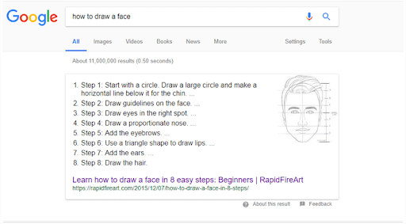
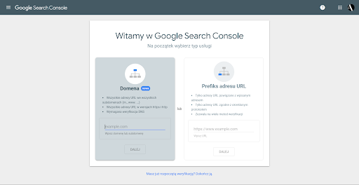

# SEO


Optymalizacja dla wyszukiwarek internetowych (ang. search engine optimization, SEO; zwana także pozycjonowaniem) 
– procesy zmierzające do osiągnięcia przez dany serwis internetowy jak najwyższej pozycji w wynikach organicznych wyszukiwarek internetowych dla wybranych słów i fraz kluczowych. 

## Podstawowe pojęcia

SERP (Search Engine Results Page) – strona internetowa wyświetlająca listę adresów znalezionych za pomocą wyszukiwarki internetowej; obejmuje ona strony znalezione automatycznie przez wyszukiwarkę i adresy wprowadzone do indeksu ręcznie oraz adresy pochodzące z bazy adresów opłacanych przez ogłoszeniodawców.
Adresy te są wyświetlane w pewnej kolejności, jako pierwsze od góry strony podawane są te, które uznane są przez wyszukiwarkę za najbardziej odpowiednie dla zapytania

## Optymalizacja
### Treści
- umieszczenie lub rozmieszczenie słów kluczowych w istniejących tekstach lub tworzenie nowych (SEO copywriting),
- dobór adekwatnych nagłówków,

### Techniczna
- dopasowanie treści w tagu tytułowym,
- odpowiednie zaaranżowanie treści menu i innych elementów, wchodzących w skład linkowania wewnętrznego serwisu,
- ustawienie tekstu alternatywnego dla elementów graficznych oraz innych obiektów.
- odpowiednie linkowanie wewnętrzne między podstronami.
- dostosowanie strony do standardów W3C,
- oddzielenia warstwy logicznej struktury dokumentu od warstwy jego prezentacji (np. poprzez zastosowanie CSS),
- poprawa czasu ładowania strony,
- zastosowanie przyjaznych adresów, np. przy użyciu mod_rewrite,
- zapewnienie alternatywnej wersji dla przeglądarek bez wsparcia dla wspomnianej technologii (w tym robotów wyszukiwarek internetowych)
- instalacja kodów Google Analytics oraz Search Console.

## Optymalizacja - przykłady
```html
<!-- Ważne, żeby były w nim zawarte słowa kluczowe odnośnie strony. Nie powinien przekraczać 70 znaków. -->
<title>TYTUŁ STRONY</title>

<!-- Najbezpieczniej - około 300 znaków  -->
<meta name="description" content="OPIS STRONY">

<!-- +og description +og:image - to linki do wyświetlania - mogą być z obrazkami, tytułami itd -->
<meta name="og:title" property="og:title" content="GRAFICZNY TYTUŁ">

```
https://ogp.me/

```html
<h1>To nagłówek 1</h1>
```
Google robi z nagłówków listy:




## robots.txt

robots.txt to zwykły plik tekstowy zgodny ze standardem wykluczania robotów . Plik robots.txt składa się z co najmniej jednej reguły. Każda reguła blokuje (lub zezwala) dostępowi dla danego przeszukiwacza do określonej ścieżki do pliku w tej witrynie.

Agent użytkownika o nazwie przeszukiwacz „Googlebot” nie powinien przeszukiwać folderu http://example.com/nogooglebot/ani żadnych podkatalogów.
Wszystkie inne programy użytkownika mogą uzyskać dostęp do całej witryny. (Można to pominąć, a wynik byłby taki sam, ponieważ założeniem jest pełny dostęp).
Plik mapy witryny witryny znajduje się pod adresem http://www.example.com/sitemap.xml

```txt
# Group 1
User-agent: Googlebot
Disallow: /nogooglebot/

# Group 2
User-agent: *
Allow: /
```

Mapa strony: http://www.example.com/sitemap.xml

### Wymagania robots.txt

#### PLIK
- Plik musi mieć nazwę robots.txt
- Twoja witryna może mieć tylko jeden plik robots.txt.
- Plik robots.txt musi znajdować się w katalogu głównym hosta witryny, którego dotyczy. Na przykład, aby kontrolować indeksowanie wszystkich poniższych adresów URL http://www.example.com/, plik robots.txt musi znajdować się pod adresem http://www.example.com/robots.txt. Nie można go umieścić w podkatalogu (na przykład http://example.com/pages/robots.txt). Jeśli nie masz pewności, jak uzyskać dostęp do katalogu głównego witryny lub potrzebujesz do tego uprawnień, skontaktuj się z dostawcą usług hostingowych. Jeśli nie możesz uzyskać dostępu do katalogu głównego witryny, użyj alternatywnej metody blokowania, takiej jak  metatagi .
- Plik robots.txt może dotyczyć poddomen (na przykład  ) lub niestandardowych portów (na przykład  ).http://website.example.com/robots.txthttp://example.com:8181/robots.txt
Komentarze to dowolna treść po znaku #.

#### SKŁADNIA
- plik robots.txt musi być plikiem tekstowym zakodowanym w formacie UTF-8 (który zawiera ASCII). Używanie innych zestawów znaków nie jest możliwe.
- Plik robots.txt składa się z co najmniej jednej grupy .
- Każda  grupa  składa się z wielu reguł lub  dyrektyw  (instrukcji), po jednej dyrektywie na linię.
- Grupa podaje następujące informacje:
- Do kogo grupa się odnosi (  agent użytkownika )
- Do których katalogów lub plików agent  może uzyskać dostęp i / lub
- Do których katalogów lub plików agent nie może uzyskać dostępu.
- Grupy są przetwarzane od góry do dołu, a agent użytkownika może dopasować tylko jeden zestaw reguł, który jest pierwszą, najbardziej szczegółową regułą, która pasuje do danego agenta użytkownika.
- Domyślnym założeniem jest to, że aplikacja kliencka może indeksować dowolną stronę lub katalog nie został zablokowany przez Disallow:zasady.
- W regułach rozróżniana jest wielkość liter . Na przykład Disallow: /file.aspdotyczy  http://www.example.com/file.asp, ale nie dotyczy  http://www.example.com/FILE.asp.


## Zaindeksuj stronę 



https://search.google.com/search-console/
