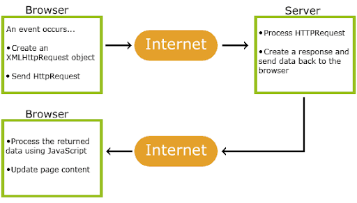

# AJAX


## Wg W3Schools

Dzięki technologii AJAX, możesz:
- Zaktualizować stronę internetową bez ponownego ładowania strony
- Żądać danych z serwera - po załadowaniu strony
- Odebrać dane z serwera - po załadowaniu strony
- Wysyłaj dane na serwer - w tle

## Co to jest AJAX?
AJAX = Asynchronous JavaScript And XML.
AJAX nie jest językiem programowania.
AJAX po prostu używa kombinacji:
Wbudowany w przeglądarkę obiekt 
XMLHttpRequest (do żądania danych z 
serwera WWW)
JavaScript i HTML DOM 
(do wyświetlania lub wykorzystywania 
danych)



## XML

Extensible Markup Language ( XML ) to język znaczników, który definiuje zestaw reguł kodowania dokumentów w formacie, który jest czytelny zarówno dla człowieka, jak i dla komputera .

XML koncentruje się głównie na przesyłaniu danych, podczas gdy HTML koncentruje się na prezentacji danych.
AJAX to myląca nazwa. Aplikacja AJAX może wykorzystywać XML do przesyłania danych, ale jest równie powszechna w transporcie danych jak zwykły tekst lub tekst JSON.

## Przykład	
```js
function loadDoc() {
  var xhttp = new XMLHttpRequest();
  xhttp.onreadystatechange = function() {
    if (this.readyState == 4 && this.status == 200) {
 	document.getElementById("demo").innerHTML = this.responseText;
    }
  };
  xhttp.open("GET", "ajax_info.txt", true);
  xhttp.send();
}
```
https://www.w3schools.com/xml/ajax_intro.asp

