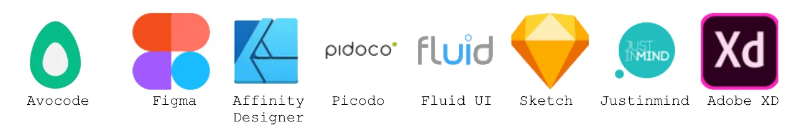

# SZABLONY
DESIGN STRON WWW

## Formaty szablonów
Szablony stron to warstwowe obrazki stworzone w formatach:
*.psd - szablon programu photoshop
*.fig - szablon programu figma

## Oprogramowanie
Najpopularniejsze programy wspomagające pracę z szablonami

## Skąd wziąć szablon?
FIG:
https://dribbble.com/search/shots/popular/web-design?q=figma
https://www.figmacrush.com/figma-website-templates/

PSD:
https://symu.co/freebies/
http://www.freebiespsd.com/search/label/Web%20Templates
https://psdfreebies.com/psd/category/web-elements/web-templates/

## Ćwiczenie 1
Zaprojektuj swoją stronę portfolio korzystając z któregoś z podanych programów.

Możesz zainspirować się stroną symu.co 

Za pomocą przedstawionego oprogramowania przerób go na wersję html, zachowując wszelkie dotychczas poznane standardy.
