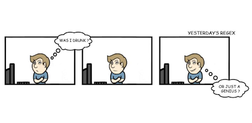

# Regular Expression (RegEx / RegExp)
Wyrażenie regularne - wzorzec opisujący łańcuch symboli. Wyrażenia regularne mogą określać zbiór pasujących łańcuchów, jak również wyszczególniać istotne części łańcucha.

[REGEX EDITOR](https://regexr.com/)

## Klasy znaków
- [ABC] - zestaw znaków - dowolny znak w zestawie
- [^ABC] - zanegowany zbiór - dowolny znak którego nie ma w zestawie
- [A-Z] - zakres - dopasowuje znak mający będący pomiędzy podanym włącznie
- . (kropka) - dowolny znak z wyjątkiem łamania linii
- [\s\S] - dowolny znak włącznie z łamaniem linii ( /s łapie białe znaki, /S - łapie wszystko poza białymi znakami)
- \w - całe słowo ze znakami alfanumerycznymi [A-Za-z0-9]
- \W - wszystko poza powyższym
- \d - digit - cyfra [0-9]
- \D - wszystko poza cyfrą

## Anchors
- ^ - początek ciągu lub wiersza (w zależności od flag)
- $ - koniec ciągu lub wiersza (w zależności od flag)
- \b - granica słowa (musi występować z czymś innym)
- \B - odwrotność granicy słowa

## Escape characters
- \+ - zastrzeżone znaki (+*?^$\.[]{}()|/) - te znaki mają znaczenia, więc jeśli chcesz ich użyć poprzedź je \  (odwrotnym ukośnikiem)
- \n - dopasowuje łamanie linii
- \t - dopasowuje tabulator

## Kwantyfikatory (dla każdego) i alternatywy
- +  - dopasowuje 1 lub więcej poprzedniego tokena
- *   - dopasowuje 0 lub więcej do poprzedniego tokena
- {1,3} - dopasowuje określoną ilość do danego tokena (od 1 do 3) ({3,} dopasuje 3 lub więcej)
- ? - dopasuje 0 lub 1 do tokena (np colou?r dopasuje się do color i colour)
- Postawiony za jakimś kwantyfikatorem (np + ) sprawia, że ten staje się leniwy (dopasowuje się do jaknajmniejszej liczby znaków)
- | - dopasowuje wyrażenie przed lub po, działa jak OR (lub) np : dla b(a|e|i)d w wyrażeniu bad bud bod bed bid dostosują się bad, bed i bid

## Grupy i referencje
- (ABC) - grupuje wiele znaków, tworzy grupę przechwytującą
- \1 - dopasowuje wyniki grupy przechwytywania \1 dopasowuje pierwszą grupę \3 trzecią itd. Np (\w)a\1 zaznaczy każde słowo, gdzie przed literą a jest to samo co za nią
- (?:ABC) - grupa nie przechwytująca
- (?!ABC) - określa grupę, której nie można dopasować po głównym wyrażeniu (np \d(?!px) z zakresu 1pt 2px 3em 4px weźmie tylko 1 i 3)

## Flagi
Flag używamy po drugim backslashu w wyrażeniach /\w+/g
- i - ignore case - nie zwraca uwagi na wielkość znaków
- g - global search - szukaj w całym wyrażeniu - pozwala na znalezienie więcej niż 1 dopasowania
- m - multiline - gdy flaga jest włączona, kotwice początku i końca ( ^ i $) będą dopasowywać początek i koniec wiersza zamiast początek i koniec całego ciągu

## Ćwiczenie REGEX
<iframe src="/src_html/regex.html" style="min-height:50vh;"></iframe>