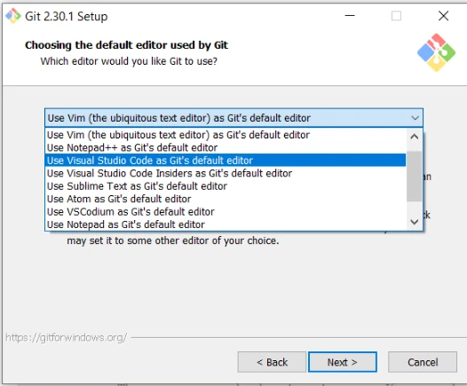

# Systemy kontroli wersji
## Czym są?
(ang. version/revision control system) – oprogramowanie służące do śledzenia zmian głównie w kodzie źródłowym oraz pomocy programistom w łączeniu zmian dokonanych w plikach przez wiele osób w różnym czasie.

Systemy kontroli wersji dzielą się na:
  - lokalne, pozwalające na zapisanie danych jedynie na lokalnym komputerze (np. SCCS oraz RCS)
  - scentralizowane, oparte na architekturze klient-serwer (np. CVS, Subversion)
  - rozproszone, oparte na architekturze P2P(peer to perr - osoba do osoby) (np. BitKeeper, Code Co-op, Git, svk).

## GIT
rozproszony system kontroli wersji. Stworzył go Linus Torvalds jako narzędzie wspomagające rozwój jądra Linux. Git stanowi wolne oprogramowanie i został opublikowany na licencji **GNU GPL w wersji 2**.
- wolność uruchamiania programu w dowolnym celu (wolność 0)
- wolność analizowania, jak program działa i dostosowywania go do swoich potrzeb (wolność 1)
- wolność rozpowszechniania niezmodyfikowanej kopii programu (wolność 2)
- wolność udoskonalania programu i publicznego rozpowszechniania własnych ulepszeń, dzięki czemu może z nich skorzystać cała społeczność (wolność 3)

Prace nad Gitem rozpoczęły się po tym, jak BitKeeper, używany wtedy do rozwoju Linuksa, przestał być darmowy dla projektów o otwartym kodzie źródłowym. Torvalds szukał rozproszonego systemu kontroli wersji, który mógłby być użyty zamiast BitKeepera, głównymi kryteriami wyboru były:

1. Przykład CVS, czego nie robić.
2. System powinien być rozproszony.
3. System powinien być chroniony przed błędami w repozytorium (przypadkowymi, jak awaria twardego dysku, jak i złośliwymi, wprowadzonymi przez kogoś).
4. System powinien być szybki.

Pierwsze dwa punkty wyeliminowały wszystko prócz Monotone'a, a czwarty punkt wyeliminował wszystko, więc Torvalds postanowił napisać własny system kontroli wersji.

## Instalacja GIT'a
Pobierz instalkę ze strony
[git-scm.com](https://git-scm.com/download/win)
i przeprowadź instalację z domyślnymi ustawieniami, poza domyślnym edytorem, który możesz zmienić na VSC 🙃

## Rozwiązania oparte na technologii GIT

  

    Jako rozproszony system kontroli wersji, Git nie wymaga odrębnej aplikacji serwerowej. Istnieją jednak pakiety rozszerzające oryginalne oprogramowanie, przede wszystkim o kontrolę dostępu, wsparcie dla zarządzania wieloma repozytoriami, czy interfejs WWW. Przykłady niektórych popularnych projektów to <b>GitHub, Bitbucket, GitLab, Git Daemon, Gitolite, Gerrit, Gitiles, Bonobo Git Server, Git Server.</b>
  

  

    
  

